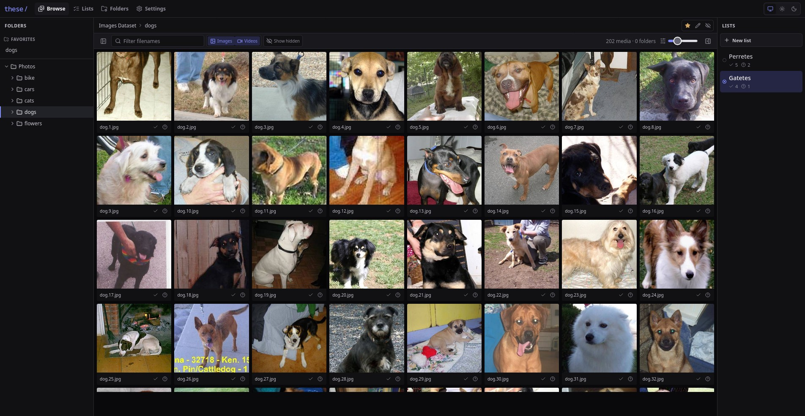
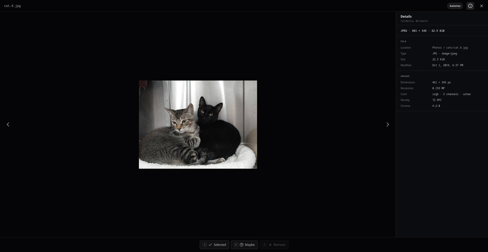
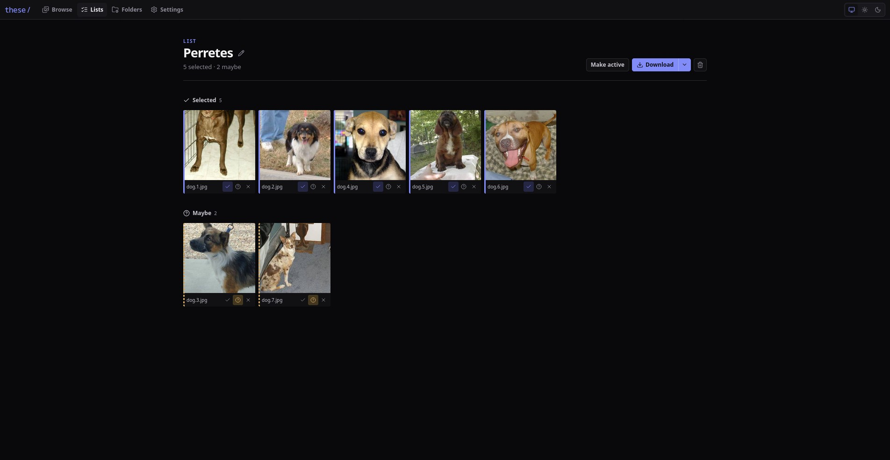

<div align="center">
  
  <h1><em>these</em></h1>
  <p><strong>Your folders are already the library.</strong></p>
  <p>
    A self-hosted gallery for browsing image and video folders, building shortlists,<br />
    and downloading the keepers — without importing, moving, or reorganizing a file.
  </p>
  <p>
    <a href="#quick-start">Quick start</a> ·
    <a href="#how-it-works">How it works</a> ·
    <a href="#configuration">Configuration</a> ·
    <a href="#development">Development</a>
  </p>
</div>



*Demo media shown throughout this README comes from the [Images Dataset](https://www.kaggle.com/datasets/pavansanagapati/images-dataset) on Kaggle.*

## What is *these*?

*these* is a directory-first media gallery for NAS and homelab collections. Point it at the folders you already have and browse them as they are on disk. The filesystem remains the source of truth; *these* adds only the small amount of state needed to curate it.

- **Browse lazily.** Only the folder you open is read; there is no startup scan or import pipeline.
- **Keep originals untouched.** Media mounts can be read-only. Files are never moved, renamed, or stored in SQLite.
- **Make useful selections.** Sort files into **Selected** and **Maybe**, review them side by side, then stream a ZIP.
- **Tame large trees.** Give folders aliases, mark favorites, and hide branches without changing anything on disk.
- **Stay self-hosted.** One container serves the React app, API, SQLite metadata, thumbnails, and video tooling.

> [!IMPORTANT]
> *these* is currently a single-user application with no built-in authentication. Keep it on a trusted network or place it behind your own access control.

## A quick tour

### Browse the filesystem, not a catalog

The three-pane browser keeps folders, media, and active lists in one place. Search the open folder by media filename, immediate subfolder name, or folder alias; filter by media type, resize thumbnails, and classify files without leaving the gallery.

### Inspect and classify without breaking your flow

Open an image or video in the focused viewer, move through the folder with the arrow keys, and use `1`, `2`, or `0` to update the active list. Technical metadata is fetched only when the details panel is opened.



### Review the keepers

Each list separates confident picks from second-pass candidates. Items can move between groups or be removed inline, and downloads stream directly from the mounted originals.



## How it works

```text
Browser
  └─ React + Vite
       └─ REST API
            └─ Fastify
                 ├─ mounted media (read-only is fine)
                 ├─ sharp / ffmpeg → disposable thumbnail cache
                 └─ Drizzle ORM → SQLite metadata
```

The server enumerates a directory only when it is opened. Folder children, media pages, thumbnails, and technical metadata are all loaded independently and on demand.

SQLite stores only *these*-owned state:

- lists and each item's **Selected** or **Maybe** status;
- folder aliases, favorites, and hidden flags;
- configured media roots and the active list.

Original media is read directly from the mounted filesystem and is never copied into the database. Every file access is checked both lexically and through `realpath`, preventing traversal and symlink escapes outside configured roots. See [the architecture notes](docs/ARCHITECTURE.md) for the full design.

## Quick start

### Docker Compose

Copy the example and replace its host paths with your own:

```sh
cp docker-compose.example.yml docker-compose.yml
docker compose up -d
```

Open [http://localhost:4000](http://localhost:4000), go to **Settings → Media roots**, and add the container path of each mounted library — for example `/media/photos`.

The included Compose file pulls the public image from GitHub Container Registry. A minimal mount setup looks like this:

```yaml
services:
  these:
    image: ghcr.io/easis/these:latest
    ports:
      - "4000:4000"
    volumes:
      - ./data:/data
      - /volume1/photos:/media/photos:ro
      - /volume1/videos:/media/videos:ro
```

To update to the latest image:

```sh
docker compose pull
docker compose up -d
```

### Install as an app

*these* includes a web app manifest and service worker, so supported browsers can install it from their native install menu. The installed app opens in its own standalone window.

The service worker caches only the application shell: HTML, JavaScript, CSS, and icons. API responses, thumbnails, original media, and list changes still require a connection to the *these* server and are not stored for offline use. If the server is unavailable, the cached shell shows a retryable connection screen and refreshes automatically when the browser comes back online.

Service workers require a secure browser context. Plain HTTP works on `localhost` for development, but access from another computer or phone should use HTTPS through a reverse proxy such as Caddy, Traefik, or nginx. The *these* container continues to serve HTTP internally; TLS termination and certificates stay with the proxy.

When a new frontend version is deployed, it is downloaded in the background and becomes active after all open *these* tabs or installed windows have been closed and reopened. An active session is never force-reloaded.

Here `/volume1/photos` is the real host directory and `/media/photos` is its stable path inside the container. Add `/media/photos` in *these* after the service starts. The display label can be anything you like.

> [!TIP]
> Keep media mounts read-only with `:ro`. Only `/data` needs to be writable.

### First-run checklist

1. Mount one or more media directories into the container.
2. Add their absolute **container paths** in **Settings → Media roots**.
3. Create a list and make it active.
4. Browse a folder and mark files **Selected** or **Maybe**.
5. Open the list to review or download the selection as a ZIP.

## Everyday workflow

### Lists

A list is one independent selection with two review states:

- **Selected** is the default download group.
- **Maybe** keeps uncertain files ready for a second pass.

A media path can have only one state in a list, so moving an item from Maybe to Selected never duplicates it. The same file may belong to several different lists.

**Download Selected** streams a ZIP directly from mounted files. Maybe and all-item downloads are also available from the list screen and API. If basenames collide, later entries become `name (2).ext`, `name (3).ext`, and so on. Missing files are skipped without deleting their saved references.

### Folder metadata

Folder metadata changes how the tree is presented, never the directory itself:

- an **alias** replaces the visible folder name;
- a **favorite** adds a shortcut above the tree;
- a **hidden** folder removes its entire subtree from normal navigation.

Use inline actions while browsing, or open **Folders** to search and repair metadata centrally. If a mounted path changes, update the recorded path there; the alias and flags remain attached to the same internal record.

### Keyboard shortcuts

Shortcuts apply to the focused thumbnail or the open viewer.

| Key | Action |
| --- | --- |
| `Enter` / `Space` | Open the focused thumbnail |
| `←` / `→` | Previous / next media |
| `1` | Mark **Selected** in the current list |
| `2` | Mark **Maybe** in the current list |
| `0` | Remove from the current list |
| `I` | Show or hide technical details |
| `Esc` | Close the viewer or cancel alias editing |

## Configuration

| Variable | Default | Purpose |
| --- | --- | --- |
| `DATA_DIR` | `/data` | SQLite database and thumbnail cache location |
| `HOST` | `0.0.0.0` | HTTP bind address |
| `PORT` | `4000` | HTTP port |
| `LOG_LEVEL` | `info` | Fastify log level; use `silent` for tests |

### Persistent data and backups

`/data/these.db` contains lists, folder metadata, roots, and application settings. SQLite also creates `these.db-wal` and `these.db-shm` while running in WAL mode.

`/data/cache` contains disposable thumbnails. It can be deleted while *these* is stopped and will be rebuilt on demand. Back up the SQLite files if your selections and folder metadata matter; original media is not part of a *these* backup.

### Moving mounted folders

*these* persists media and folder references using absolute container paths. If a Compose change moves `/media/photos/trips` to `/media/archive/trips`, old references appear as **Missing**. Open **Folders**, edit the path to the new mounted location, and save it.

The repaired path must resolve to a directory inside a configured media root. Traversal, external absolute paths, and symlink escapes are rejected.

## Supported media

**Images:** JPEG, PNG, BMP, WebP, AVIF, GIF (first frame), TIFF, HEIC, and HEIF where the installed `sharp` build can decode them.

**Videos:** MP4, MOV, M4V, WebM, MKV, and AVI. Browser playback still depends on available browser codecs; `ffmpeg` generates video thumbnails.

Files with other extensions are ignored by the gallery.

## Development

Requirements:

- Node.js 22 or newer;
- pnpm 10;
- `ffmpeg` and `ffprobe` on `PATH` for video thumbnails and metadata.

```sh
pnpm install
cp .env.example .env
pnpm dev
```

Vite runs at [http://localhost:5173](http://localhost:5173) and proxies `/api` to Fastify on port `4000`. Add absolute local paths from **Settings** after startup.

The server reads environment files from the repository root with `dotenv-flow`. In development, precedence is `.env`, `.env.local`, `.env.development`, then `.env.development.local`; already-exported shell variables win. Relative paths such as `DATA_DIR=./data` resolve from the repository root.

Run the complete verification suite:

```sh
pnpm check
```

Or run individual stages:

```sh
pnpm typecheck
pnpm test
pnpm build
```

Tests cover filesystem containment, symlink escape prevention, folder metadata repair, list state constraints, missing media, filtered pagination, request races, byte ranges, and ZIP filename collisions.

### Production build

```sh
pnpm build
pnpm start
```

`pnpm start` expects an existing production build. To build the single-service container directly:

```sh
docker build -t these:local .
```

The runtime image contains Node.js, the Fastify server, the compiled React application, production dependencies, and `ffmpeg`.

## Current limitations

- Single-user; no built-in authentication.
- No global, recursive, or fuzzy search. Search applies only to the immediate contents of the open folder.
- Folder moves are repaired manually rather than detected automatically.
- Directory symlinks are hidden; direct symlink paths cannot escape a root.
- The list review screen loads up to 1,000 items. Downloads use a larger bounded set and stream their contents.
- Mobile uses touch-first navigation and a compact options sheet; the media viewer remains deliberately focused on one item at a time.

## License

Released under the [MIT License](LICENSE).
