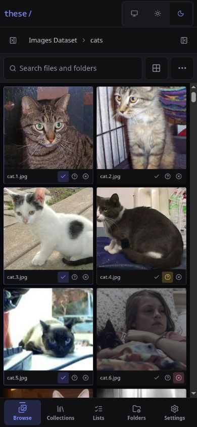

<div align="center">
  
  <h1><em>these</em></h1>
  <p><strong>Your folders are already the library.</strong></p>
  <p>
    A self-hosted gallery for browsing image and video folders, reviewing your choices,<br />
    and downloading the keepers — without importing, moving, or reorganizing a file.
  </p>
  <p>
    
    <a href="https://developers.openai.com/codex/">
      
    </a>
  </p>
  <p>
    <a href="#quick-start">Quick start</a> ·
    <a href="#how-it-works">How it works</a> ·
    <a href="#configuration">Configuration</a> ·
    <a href="#development">Development</a>
  </p>
</div>

> [!WARNING]
> **Experimental software:** *these* is under active development and is not yet considered stable. Expect frequent breaking changes to features, configuration, APIs, and stored metadata. Review release notes and back up `/data` before updating.

> [!NOTE]
> **AI disclosure:** *these* is being developed with [OpenAI Codex](https://developers.openai.com/codex/). Code, tests, documentation, and other project assets may include AI-generated or AI-assisted contributions.


*Demo media shown throughout this README comes from the [Images Dataset](https://www.kaggle.com/datasets/pavansanagapati/images-dataset) on Kaggle.*

## What is *these*?

*these* is a directory-first media gallery for NAS and homelab collections. Point it at the folders you already have and browse them as they are on disk. There is no import step: the filesystem remains the source of truth, while *these* stores only the small amount of metadata needed to help you review and organize it.

- **Browse lazily.** Only the folder you open is read, and more media loads automatically as you scroll. There is no startup scan or import pipeline.
- **Keep originals untouched.** Media mounts can be read-only. Files are never moved, renamed, or stored in SQLite.
- **Make clear decisions.** Mark files **Selected**, **Maybe**, or **Discarded**; every decision remains reversible.
- **Tame large trees.** Give folders aliases, mark favorites, hide branches, and group folders into collections without changing anything on disk.
- **Use it anywhere.** The responsive interface works on desktop and mobile and can be installed as a PWA.
- **Stay self-hosted.** One container serves the React app, API, SQLite metadata, thumbnails, and video tooling.

> [!IMPORTANT]
> *these* is currently a single-user application with no built-in authentication. Keep it on a trusted network or place it behind your own access control.

## A quick tour

### Browse the filesystem, not a catalog

The three-pane browser keeps the folder tree, media gallery, and active list in one place. Switch the tree between **All folders** and any collection, search the open folder by filename, immediate subfolder name, or folder alias, and filter by media type. Thumbnail size, sidebars, and mobile density can all be adjusted without leaving the gallery.

### Inspect and classify without breaking your flow

Open an image or video in the focused viewer, move through the folder with the arrow keys, and use `1`, `2`, `3`, or `0` to update the active list. Images can be fitted, viewed at actual size, zoomed, and panned. Technical metadata is fetched only when the details panel is opened.


### Review the keepers

Each list separates confident picks, second-pass candidates, and recoverable discards. Items can move between groups or be unclassified inline. The list index can be searched, filtered, and sorted, while ZIP downloads stream directly from the mounted originals.


## How it works

```text
Browser
  └─ React + Vite
       └─ REST API
            └─ Fastify
                 ├─ mounted media (read-only is fine)
                 ├─ sharp / ffmpeg → disposable thumbnail cache
                 └─ Drizzle ORM → SQLite metadata
```

The server enumerates a directory only when it is opened. Folder children, media pages, thumbnails, and technical metadata are all loaded independently and on demand.

SQLite stores only *these*-owned state:

- lists and each item's **Selected**, **Maybe**, or reversible **Discarded** status;
- named folder collections and their many-to-many memberships;
- folder aliases, favorites, and hidden flags;
- configured media roots and the active list.

Original media is read directly from the mounted filesystem and is never copied into the database. Every file access is checked both lexically and through `realpath`, preventing traversal and symlink escapes outside configured roots. See [the architecture notes](docs/ARCHITECTURE.md) for the full design.

## Quick start

### Docker Compose

Copy the example and replace its host paths with your own:

```sh
cp docker-compose.example.yml docker-compose.yml
docker compose up -d
```

Open [http://localhost:4000](http://localhost:4000), go to **Settings → Media roots**, and add the container path of each mounted library — for example `/media/photos`.

A **media root** is simply a top-level folder that *these* is allowed to browse. In Docker, always enter the path as it appears **inside the container**, not the original host path.

The included Compose file pulls the public image from GitHub Container Registry. A minimal mount setup looks like this:

```yaml
services:
  these:
    image: ghcr.io/easis/these:latest
    ports:
      - "4000:4000"
    volumes:
      - ./data:/data
      - /volume1/photos:/media/photos:ro
      - /volume1/videos:/media/videos:ro
```

Here `/volume1/photos` is the real host directory and `/media/photos` is its stable path inside the container. Add `/media/photos` in *these* after the service starts; its display label can be anything you like.

> [!TIP]
> Keep media mounts read-only with `:ro`. Only `/data` needs to be writable.

To update to the latest image:

```sh
docker compose pull
docker compose up -d
```

### Install as an app

*these* includes a web app manifest and service worker, so supported browsers can install it from their native install menu. The installed app opens in its own standalone window.

<p align="center">
  
</p>

*The responsive media browser at a 390 × 844 mobile viewport.*

The service worker caches only the application shell: HTML, JavaScript, CSS, and icons. API responses, thumbnails, original media, and list changes still require a connection to the *these* server and are not stored for offline use. If the server is unavailable, the cached shell shows a retryable connection screen and refreshes automatically when the browser comes back online.

Service workers require a secure browser context. Plain HTTP works on `localhost` for development, but access from another computer or phone should use HTTPS through a reverse proxy such as Caddy, Traefik, or nginx. The *these* container continues to serve HTTP internally; TLS termination and certificates stay with the proxy.

When a new frontend version is deployed, it is downloaded and activated automatically instead of waiting for every open *these* tab or installed window to close. Open browser tabs and installed apps reload automatically once the update is ready.

### First-run checklist

1. Mount one or more media directories into the container.
2. Add their absolute **container paths** in **Settings → Media roots**.
3. Create a list and make it active. The active list receives classifications made while browsing.
4. Browse a folder and mark files **Selected**, **Maybe**, or **Discarded**.
5. Open the list to review or download the selection as a ZIP.

## Everyday workflow

### Lists

A list is one independent review with three states:

- **Selected** is the default download group.
- **Maybe** keeps uncertain files ready for a second pass.
- **Discarded** records a negative decision without losing it; the group starts collapsed on the review screen and can be restored at any time.

A media path can have only one state in a list, so moving an item between groups never duplicates it. The same file may belong to several different lists, and only the active list changes while you classify media in the browser.

The Lists screen supports name search, **With media**/**Empty** filters, and alphabetical or media-count sorting. **Download Selected** streams a ZIP directly from mounted files; **Maybe** and **All (Selected + Maybe)** downloads are also available. Discarded files are never included automatically. If basenames collide, later entries become `name (2).ext`, `name (3).ext`, and so on. Missing files are skipped without deleting their saved references.

### Browsing and search

The gallery reads media in bounded pages and fetches the next page automatically as you approach the end. Search and image/video filters apply to the open folder only, so even very large directory trees do not need a global index.

On desktop, the folder and list sidebars can be resized or collapsed. On mobile, the same controls move into touch-friendly panels and the gallery offers compact and comfortable densities.

### Folder metadata

Folder metadata changes how the tree is presented, never the directory itself:

- an **alias** replaces the visible folder name;
- a **favorite** adds a shortcut above the tree;
- a **hidden** folder removes its entire subtree from normal navigation.

Use inline actions while browsing, or open **Folders** to search and repair metadata centrally. If a mounted path changes, update the recorded path there; the alias and flags remain attached to the same internal record.

### Folder collections

A collection groups related folders without moving or copying their contents. Open **Collections** to create and manage groups, or use **Add to collections** on the current folder or any child folder while browsing. One folder can belong to several collections. Collection and list indexes can both be searched, filtered, and sorted.

Opening a collection shows its member folders as shortcuts into the regular browser. The folder-tree scope picker also lets you stay inside a collection while moving between its member folders and descendants. Members are sorted by their visible alias or folder name. If an entire media root or an individual folder is temporarily inaccessible, its membership is retained and marked unavailable. If the root is available but a member folder has been definitively removed—or its stored path is no longer inside any configured root—the stale membership is removed automatically the next time collections are loaded.

### Keyboard shortcuts

Shortcuts apply to the focused thumbnail or the open viewer.

| Key | Action |
| --- | --- |
| `Enter` / `Space` | Open the focused thumbnail |
| `←` / `→` | Previous / next media |
| `1` | Mark **Selected** in the current list |
| `2` | Mark **Maybe** in the current list |
| `3` | Mark **Discarded** in the current list |
| `0` | Remove from the current list |
| `I` | Show or hide technical details |
| `+` / `-` | Zoom an image in or out |
| `F` / `A` | Fit an image / show it at actual size |
| `Esc` | Close the viewer or cancel an open text dialog |

## Configuration

| Variable | Default | Purpose |
| --- | --- | --- |
| `DATA_DIR` | `/data` | SQLite database and thumbnail cache location |
| `HOST` | `0.0.0.0` | HTTP bind address |
| `PORT` | `4000` | HTTP port |
| `LOG_LEVEL` | `info` | Fastify log level; use `silent` for tests |

### Persistent data and backups

`/data/these.db` contains lists, folder collections, folder metadata, roots, and application settings. SQLite also creates `these.db-wal` and `these.db-shm` while running in WAL mode.

`/data/cache` contains disposable thumbnails. It can be deleted while *these* is stopped and will be rebuilt on demand. Back up the SQLite files if your selections and folder metadata matter; original media is not part of a *these* backup.

### Moving mounted folders

*these* persists media and folder references using absolute container paths. If a Compose change moves `/media/photos/trips` to `/media/archive/trips`, old references appear as **Missing**. Open **Folders**, edit the path to the new mounted location, and save it.

The repaired path must resolve to a directory inside a configured media root. Traversal, external absolute paths, and symlink escapes are rejected.

## Supported media

**Images:** JPEG, PNG, BMP, WebP, AVIF, GIF (first frame), TIFF, HEIC, and HEIF where the installed `sharp` build can decode them.

**Videos:** MP4, MOV, M4V, WebM, MKV, and AVI. Browser playback still depends on available browser codecs; `ffmpeg` generates video thumbnails.

Files with other extensions are ignored by the gallery.

## Development

Requirements:

- Node.js 22 or newer;
- pnpm 11;
- `ffmpeg` and `ffprobe` on `PATH` for video thumbnails and metadata.

```sh
pnpm install
cp .env.example .env
pnpm dev
```

Vite runs at [http://localhost:5173](http://localhost:5173) and proxies `/api` to Fastify on port `4000`. Add absolute local paths from **Settings** after startup.

The server reads environment files from the repository root with `dotenv-flow`. In development, precedence is `.env`, `.env.local`, `.env.development`, then `.env.development.local`; already-exported shell variables win. Relative paths such as `DATA_DIR=./data` resolve from the repository root.

Run the complete verification suite:

```sh
pnpm check
```

Or run individual stages:

```sh
pnpm typecheck
pnpm test
pnpm build
```

Tests cover filesystem containment, symlink escape prevention, folder and collection metadata, all three list states, missing media, filtered and automatic pagination, responsive controls, request races, byte ranges, and ZIP filename collisions.

### Production build

```sh
pnpm build
pnpm start
```

`pnpm start` expects an existing production build. To build the single-service container directly:

```sh
docker build -t these:local .
```

The runtime image contains Node.js, the Fastify server, the compiled React application, production dependencies, and `ffmpeg`.

## Current limitations

- Single-user; no built-in authentication.
- No global, recursive, or fuzzy media search. Gallery search applies only to the immediate contents of the open folder.
- Folder moves are repaired manually rather than detected automatically.
- Directory symlinks are hidden; direct symlink paths cannot escape a root.
- ZIP downloads are bounded to 100,000 list items per request and can be resource-intensive for very large selections.
- Mobile uses touch-first navigation and a compact options sheet; the media viewer remains deliberately focused on one item at a time.

## License

Released under the [MIT License](LICENSE).
